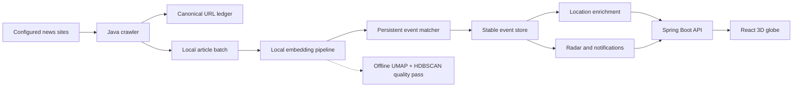

# NewsMap

**A location-aware news discovery platform that turns individual articles into persistent, evolving events on a 3D globe.**

NewsMap is a local-first full-stack prototype for exploring how the same real-world event is reported across sources and over time. Instead of sending every article to an LLM or rebuilding unstable clusters after each crawl, the system embeds articles locally and asks a continuous question:

> Does this article belong to an existing event, or is it the first report of a new one?

The result is a set of stable event identities that can support timelines, source comparison, follows, personalized ranking, and notifications as the story develops.

## Why this project exists

Traditional news feeds are organized around articles. This creates repetition, makes it difficult to follow an evolving story, and treats multiple reports about the same event as unrelated items.

NewsMap experiments with an event-centered alternative:

- collect reporting from multiple international publishers;
- detect duplicate and related coverage using local embeddings and structured signals;
- preserve event IDs across subsequent pipeline runs;
- infer where events are happening and display them geographically;
- let users follow topics, locations, entities, sources, or individual events;
- notify users about meaningful event changes rather than every new article.

## Current capabilities

- **Interactive 3D globe** with zoom-aware hotspot aggregation and event exploration.
- **Multi-source Java crawler** configured for AP, BBC, CNN, Euronews, and Al Jazeera.
- **Incremental fetching** with a persistent crawl ledger that rejects previously fetched canonical URLs.
- **Persistent event matching** using embeddings, entities, title overlap, recency, location, and source evidence.
- **Stable event lifecycle** with `ACTIVE`, `DORMANT`, and `ARCHIVED` states plus reopening support.
- **Local geolocation** from explicit place evidence, with an optional Gemini fallback for ambiguous events.
- **Accounts and session authentication** with BCrypt password hashing and CSRF protection.
- **My Radar** for following interests and ranking active events with inspectable matching reasons.
- **Event-driven notifications** with priorities, quiet hours, per-follow notification levels, digest aggregation, and a durable delivery outbox.
- **Offline quality analysis** using UMAP and HDBSCAN without making corpus-wide clustering the product's identity layer.

## How it works



The persistent event database is the canonical identity layer. HDBSCAN remains useful for offline evaluation and the current legacy hotspot projection, but it does not determine stable event IDs.

## Technology stack

| Layer | Technologies |
| --- | --- |
| Frontend | React 19, Vite, Three.js, `react-globe.gl`, Supercluster |
| Backend | Java 21, Spring Boot 3, Spring Security, embedded Tomcat |
| Storage | SQLite for events, accounts, follows, notifications, and crawl history |
| ML pipeline | Python 3.10+, PyTorch, Transformers, Jina embeddings, UMAP, HDBSCAN, scikit-learn |
| Data collection | Java, jsoup, Crawler Commons, source-specific JSON configuration |

No external AI API key is required for crawling, embedding, event matching, clustering, accounts, or personalization.

## Project structure

```text
NewsMap/
├── src/
│   ├── crawler/                 # Source crawling and duplicate prevention
│   ├── analysis/                # Location and hotspot enrichment
│   └── main/newsmap/
│       ├── web/                 # Spring Boot API, auth, scheduler, Radar, notifications
│       └── ...                  # Original JavaFX client retained during migration
├── frontend/                    # React/Vite browser application
├── embeddings-service/         # Embeddings, event matching, clustering, and tests
├── configs/newsConfigs/         # Publisher crawling rules
├── resources/                   # Spring configuration and geographic data
└── docs/                        # Product and implementation roadmaps
```

## Running locally

### Prerequisites

- Java 21+
- Python 3.10+
- Node.js and npm
- A Unix-like shell for the commands below

### 1. Prepare the Python environment

From the repository root:

```bash
cd embeddings-service
python3 -m venv venv
source venv/bin/activate
pip install -r requirements.txt
pip install -e .
cd ..
```

The first embedding run may take longer while the local model is downloaded and initialized.

### 2. Start the backend

```bash
./mvnw spring-boot:run
```

The API runs at `http://127.0.0.1:8080`.

### 3. Start the frontend

In a second terminal:

```bash
cd frontend
npm install
npm run dev
```

Open `http://127.0.0.1:5173`.

## Automatic news pipeline

While the backend is running, Spring schedules the incremental gathering pipeline every 15 minutes. The interval and per-source limit are configured in `resources/application.properties`:

```properties
newsmap.pipeline.cron=0 */15 * * * *
newsmap.pipeline.max-articles-per-source=100
```

Each scheduled run:

1. crawls the configured publisher pages;
2. skips canonical URLs already recorded in `data/crawl-ledger.db`;
3. embeds only the newly collected article batch;
4. matches those articles against persistent events;
5. enriches event locations and refreshes notification state;
6. runs an offline clustering quality pass and updates the globe projection.

If no new articles are found, the expensive embedding and matching stages are skipped.

## Optional Gemini location fallback

Most location evidence is resolved locally. A Gemini key can optionally be supplied for events whose location remains ambiguous:

```bash
export GEMINI_API_KEY="your-key"
./mvnw spring-boot:run
```

`GOOGLE_API_KEY` is also accepted. The fallback model defaults to `gemini-2.5-flash-lite` and can be changed with `GEMINI_MODEL`.

## Main API areas

Public news exploration:

- `GET /api/events`
- `GET /api/events/{eventId}`
- `GET /api/hotspots`
- `GET /api/articles`

Authentication:

- `GET /api/auth/csrf`
- `POST /api/auth/signup`
- `POST /api/auth/login`
- `POST /api/auth/logout`
- `GET /api/auth/me`

Authenticated personalization:

- `GET /api/radar`
- `/api/users/{userId}/follows`
- `/api/users/{userId}/notification-preferences`
- `/api/notifications`
- `/api/notifications/outbox`

Pipeline and event-quality endpoints are also available for local inspection. Protected mutations use session authentication and CSRF tokens.

## Persistence model

- `embeddings-service/outputs/events.db` stores canonical event identity and lifecycle state.
- `embeddings-service/outputs/events.json` is the generated, geolocated API projection.
- `data/crawl-ledger.db` records fetched canonical article URLs.
- `data/personalization.db` stores accounts, follows, preferences, inbox state, and delivery intent.

Generated data and local databases are intentionally excluded from version control.

## Current status and limitations

NewsMap is an active local prototype, not yet a production deployment.

- Event matching and location inference still need evaluation against a labeled news-event dataset.
- Email and push delivery are not connected; the durable outbox currently records delivery intent and retry metadata.
- SQLite and server-local sessions are appropriate for local development but need a deployment plan for multi-instance hosting.
- The original JavaFX client remains in the repository while the browser migration is completed.
- Some globe hotspot output still depends on the legacy offline clustering projection; the persistent event feed is the intended long-term source of truth.

The next product direction is to improve event pages with timelines, source and perspective comparison, confidence indicators, and concise “what changed?” updates. The personalization roadmap is documented in [`docs/v3-personalization-roadmap.md`](docs/v3-personalization-roadmap.md).
